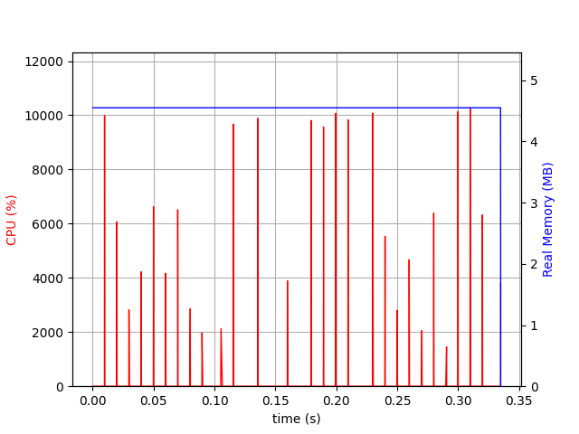
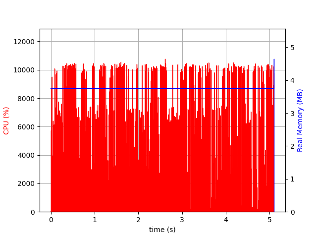
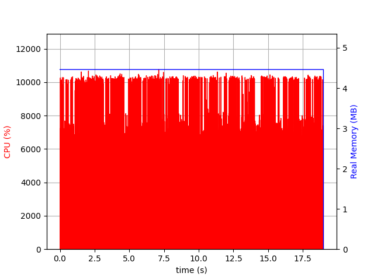

# SpamHammer

**Note**: This project is for the assessment of the subject CSSE6400 Software Architecture at the University of Queensland and is not intended for any other usage.

A command line interface for scanning emails for spam or malicious content.

## Installation

This package must be installed by collecting the static binary given in the releases.

## Usage

#### Help

```bash
spamhammer --help
```

```bash
spamhammer scan --help
```


#### Scanning an Email

Reports are generated from a JSON file like so:

```json
{
  "id": "ABCD-1234",
  "content": "Hey Valued Student\nHows the assignment going?\nRegards\nEvan Hughes",
  "metadata": "0|12"
}
```

The output is a path with a filename but no extension where a .json will be generated.

```bash
spamhammer scan --input examples/input.json --output examples/output
```

You can also use stdin and stdout for input and output.

For Input:

```bash
cat examples/input.json | spamhammer scan --input '-' --output examples/output
```

or 

```bash
cat examples/input.json | spamhammer scan --output examples/output
```

For Output:

```bash
spamhammer scan --input examples/input.json --output '-' > examples/output.json
```

or 

```bash
spamhammer scan --input examples/input.json > examples/output.json
```


Example Output:

```json
{
  "id": "ABCD-1234",
  "malicious": false
}
```

## Motivation

This project was created for the assessment of the subject CSSE6400 Software Architecture at the University of Queensland.  It is intended to generate an output that requires work, this version accomplishes this by computing an arbitrary BCRYPT hash which is thrown away. The program then generates a report based on the Fingerprint given to it.

## Fingerprint

The fingerprint is a given pipe seperated seed for SpamHammer to generate a report. The first number is a boolean 0/1 which is the malicious status of the email. The second number is the iterations of the BCRYPT hash. It is recommended to keep the iterations within 8 -> 20.

## Performance Characteristics

These stats were made on a **t3.small** using:

```bash
psrecord "spamhammer ....." --log activity.txt --plot performance.png
```

| Type                      | Stats                       |
|---------------------------|-----------------------------|
| Scan (sm) [12 iterations] |   |
| Scan (md) [16 iterations] |  |
| Scan (lg) [18 iterations] |   |

## Contributing

Contributions are welcome but the project is for the usage in an assessment so some aspects of the program are intentional to create load on the system.

## Changes

### No Releases

No releases have been made.